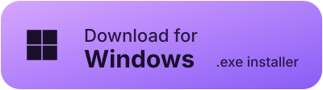
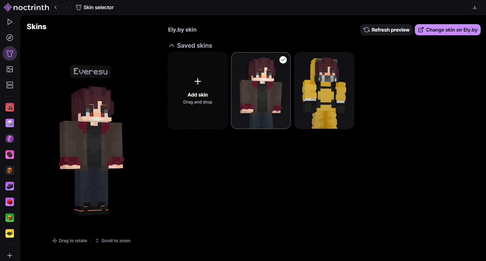
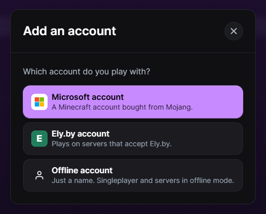
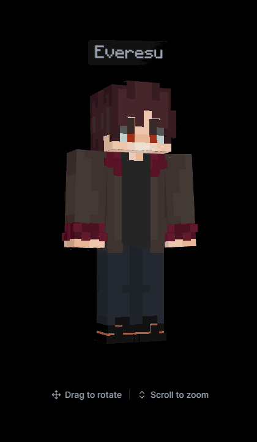
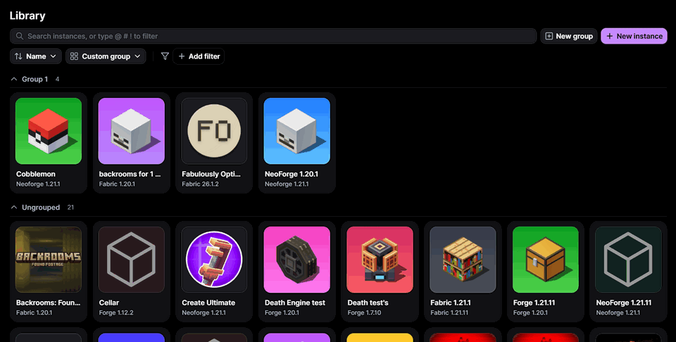
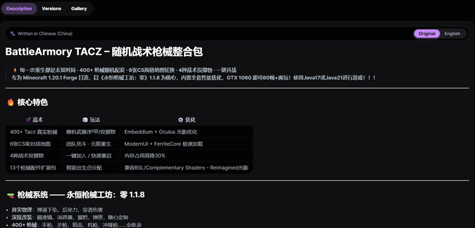
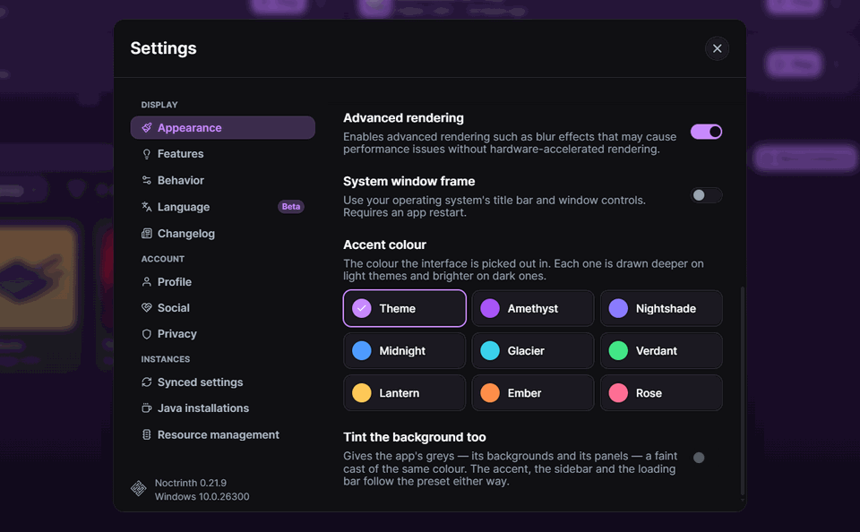

<div align="center">

[](https://github.com/Everelsu/Noctrinth/releases)
[](https://github.com/Everelsu/Noctrinth/releases)
[](apps/app/LICENSE)
[](https://github.com/Everelsu/Noctrinth/stargazers)

**English** · [Русский](README.ru.md)

**Ely.by, offline accounts and CurseForge packs, in the Modrinth App you already know.**

🌙 A Modrinth App fork that speaks Ely.by, installs CurseForge packs and gives every player on an offline server their skin 🚀

<a href="https://github.com/Everelsu/Noctrinth/releases/latest"></a>
<a href="https://github.com/Everelsu/Noctrinth/releases/latest"></a>
<a href="https://github.com/Everelsu/Noctrinth/releases/latest"></a>

[Changelog](https://everelsu.github.io/Noctrinth/) · [Releases](https://github.com/Everelsu/Noctrinth/releases) · [Issues](https://github.com/Everelsu/Noctrinth/issues) · [Discussions](https://github.com/Everelsu/Noctrinth/discussions) · [Upstream](https://github.com/modrinth/code)

</div>

---

## Screenshots

<div align="center">
<table>
<tr>
<td width="62%"><br/><sub>Ely.by skins, worn and uploaded from the launcher</sub></td>
<td width="38%"><br/><sub>Microsoft, Ely.by or just a name</sub></td>
</tr>
</table>
</div>

## Why Noctrinth

The Modrinth App is a genuinely good launcher, but it only knows Microsoft accounts, only installs Modrinth's own `.mrpack` files, and shows you ads while you browse. If you play on Ely.by or offline servers, keep a shelf of CurseForge zips, or sit behind a blocked connection, you end up running a second launcher to cover the gaps. Noctrinth covers them in the same app, and follows upstream release for release.

## What Noctrinth adds

### Accounts and skins

- **Ely.by accounts**: sign in through Ely.by's own page, launch through authlib-injector, and browse, wear, upload and delete skins in the same grid the Microsoft account uses
- **Offline accounts**: just a name, for singleplayer and offline-mode servers, wearing the cape that name has on OptiFine, LabyMod, MinecraftCapes or SkinMC
- **Skins for every player**: offline servers send no skins, so everyone is Steve. The launcher looks each player up by name on Ely.by and Mojang, with no mod on either side
- **Two copies of one instance**: launch a running instance again as another account, each copy with its own console

<div align="center"><br/><sub>The nametag turns with the model like a sign</sub></div>

### Instances and content

- **CurseForge modpack `.zip` install**: queued, resumable, rolled back cleanly on failure, with the pack's own icon
- **CurseForge instances that arrive whole**: an import fetches the mods the folder is missing, and names every CurseForge file with its real title, author and icon
- **Modrinth App migration**: a banner offers to bring Modrinth App instances over, all or hand-picked, optionally removing them from the source
- **Library search language**: `@sodium` finds instances with a mod, `#shader` filters by type, `!outdated` by state, and `-` flips a term
- **Modern Java for 1.7.10**: one click installs lwjgl3ify or Cleanroom with the launcher-side patches, and one click undoes it
- **A graphics adapter per Java runtime** on Windows, for laptops that start the game on the wrong GPU
- **Animated icons**: a GIF stays animated in the library and survives an `.mrpack` export

<div align="center"><br/><sub><code>@sodium</code> narrows the library to instances that have it</sub></div>

### Around the app

- **Description translation**: Google Translate, or DeepL with your own key, switched back to the original with one button
- **Accent presets**: nine colours for the whole interface, the splash screen, the window and taskbar icons, optionally tinting the backgrounds too
- **Touchpad navigation**: two fingers sideways go back and forward, the way Chrome does
- **Collections and followed projects**, and **Modrinth notifications**, built into the app
- **Proxy**: one URL (`http://`, `https://`, `socks5://`, `socks5h://`) for every launcher request, for regions where Modrinth is blocked
- **No ads**: Modrinth's ads, consent popup and upsells are switched off

<div align="center">
<table>
<tr>
<td width="50%"><br/><sub>A Chinese description, in English and back</sub></td>
<td width="50%"><br/><sub>Nine accents, applied as you click</sub></td>
</tr>
</table>
</div>

## Get started

### Install

Grab the installer for your platform from the [latest release](https://github.com/Everelsu/Noctrinth/releases/latest):

| Platform | Notes                               |
| -------- | ----------------------------------- |
| Windows  | Installer (NSIS)                    |
| macOS    | Universal — Intel and Apple Silicon |
| Linux    | Built on Ubuntu 22.04               |

Updates are signed and delivered automatically through GitHub Releases — no reinstalling.

> [!NOTE]
> Pre-release builds (`0.21.10-beta.1` and similar) are **not** served to the auto-updater. Install them by hand; the app will pick up the matching stable release as a normal update once it ships.

### Bring your instances over

Already on the Modrinth App? Open Noctrinth and a banner offers to import everything it finds. Prefer to choose? **Create instance → Import** lists Modrinth App next to Prism, MultiMC, ATLauncher, GDLauncher and CurseForge.

## Build from source

Requires [Node.js](https://nodejs.org/) ≥ 24.15, [pnpm](https://pnpm.io/), [Rust](https://www.rust-lang.org/tools/install), and the [Tauri prerequisites](https://v2.tauri.app/start/prerequisites/).

```bash
pnpm install
```

Copy the environment template in `packages/app-lib/`, then start the desktop app with hot reload:

```bash
pnpm app:dev
```

Before opening a pull request, run the frontend checks:

```bash
pnpm prepr:frontend:app
```

## Repository layout

This is the upstream Modrinth monorepo, so it carries far more than the launcher — the website, the backend API and the shared libraries all live here. Noctrinth ships the desktop app.

| Path                                | What it is                                             |
| ----------------------------------- | ------------------------------------------------------ |
| `apps/app`                          | Tauri shell — Rust commands, window and updater config |
| `apps/app-frontend`                 | Desktop UI (Vue 3), Noctrinth's changelog and locales  |
| `packages/app-lib`                  | Launcher core — accounts, instances, installs, imports |
| `packages/ui`                       | Shared Vue component library                           |
| `apps/frontend`, `apps/labrinth`, … | Modrinth's website and backend, carried from upstream  |

For architecture and infrastructure that isn't fork-specific, the [upstream repository](https://github.com/modrinth/code) remains the reference.

## Relationship with upstream

Noctrinth syncs with [modrinth/code](https://github.com/modrinth/code) and pins its version to upstream's exactly: when Modrinth is on `0.21.9`, so is Noctrinth. Where both sides implement the same thing, upstream's version wins and the fork's is dropped. That is how the fork's shared `options.txt` profile, screenshots tab and download cache went: upstream's settings sync, Screenshots page and content store do the same jobs better.

A fix between upstream releases ships as a micropatch (`0.21.6+1`), which installs already on that version take as a normal update. Test builds ship as pre-releases (`0.21.10-beta.1`), which sort above the current stable and below the next one, so testers roll onto the real release the moment it lands.

## Contributing

Bug reports and pull requests are welcome — [open an issue](https://github.com/Everelsu/Noctrinth/issues) to start.

Found a bug that isn't Noctrinth-specific? It belongs [upstream](https://github.com/modrinth/code/issues); fixing it there means everyone gets it, and it reaches this fork on the next sync.

If Noctrinth helped you, [give it a star](https://github.com/Everelsu/Noctrinth/stargazers).

## License

The desktop app is licensed under [GPL-3.0](apps/app/LICENSE). Other packages carry their own licenses — see the `LICENSE` file in each, and [COPYING.md](COPYING.md) for details.

Modrinth branding is the property of Rinth, Inc. and is not used here; Noctrinth ships its own. Noctrinth is an independent fork and is not affiliated with or endorsed by Rinth, Inc.
